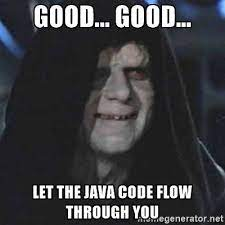

# Java 17 Best Practices



## Prefer Switch expressions over Switch statements

````java
public class SwitchesMain {


    public static void main(String[] args) {

        var passenger = new Passenger(SeatClass.ECONOMY);

        switch (passenger.seatClass) {
            case ECONOMY:
                System.out.println("Basic meal");
            case BUSINESS:
                System.out.println("Meal + dessert");
            case FIRST:
                System.out.println("Meal + dessert + champagne");
        }


        switch (passenger.seatClass) {
            case ECONOMY -> System.out.println("Basic meal");
            case BUSINESS -> System.out.println("Meal + dessert");
            case FIRST -> System.out.println("Meal + dessert + champagne");
        }

    }

    enum SeatClass {
        ECONOMY, BUSINESS, FIRST
    }
    public static class Passenger {
        SeatClass seatClass;
        public Passenger(SeatClass seatClass) {
            this.seatClass = seatClass;
        }
    }
}
````

## Prefer Text Blocks

This feature was introduced in Java 15
### Instead of this
````java
String json = "[\n" +
                "  {\n" +
                "    \"from\":\"New York\",\n" +
                "    \"to\":\"London\",\n" +
                "    \"date\":\"2022-07-07\"\n" +
                "  },\n" +
                "  {\n" +
                "    \"from\":\"Tokyo\",\n" +
                "    \"to\":\"Singapore\",\n" +
                "    \"date\":\"2022-07-10\"\n" +
                "  }\n" +
                "]";
````
### Do this

````java

String json = """
        [
          {
            "from":"New York",
            "to":"London",
            "date":"2022-07-07"
          },
          {
            "from":"Tokyo",
            "to":"Singapore",
            "date":"2022-07-10"
          }
        ]
        """;
````

[Back](./../index.md)