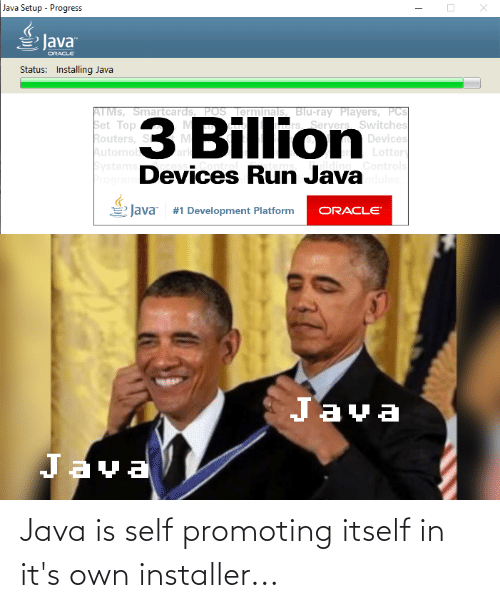

# Java SE 17 - Advanced Language Features

Java seems to be around for ages. 10+ years ago, you had to write several lines of code to achieve simpler things, 
and if we talk about complex business applications where you used to have to combine the powers of 
frameworks like Spring, Struts, Hibernate, and some application containers like Tomcat or Jboss; the things probably 
became harder to cope.

But when you pass this steep learning curve, it all comes naturally to you, and from one moment to another, 
you know where to go to solve a tricky bug or how to build an API, no matter how verbose Java is. So being a 
java developer since 2008 sometimes is quite dull; at least, this statement was true some years ago.

## How many times do you see something like this?

## Yes, Java has been around for a long time ago...

| Version          | Release Date    |
|------------------|-----------------|
| JDK Beta         | 1995            |
| JDK 1.0          | 1995            |
| JDK 1.1          | 1995            |
| JDK 1.2          | 1995            |
| JDK 1.4          | February 2002   |
| Java SE 5        | September 2004  |
| Java SE 6        | December 2006   |
| Java SE 7        | July 2011       |
| Java SE 8  (LTS) | March 2014      |
| Java SE 9        | September  2017 |
| Java SE 10       | March 2018      |
| Java SE 11 (LTS) | September  2018 |
| Java SE 12       | March 2019      |
| Java SE 13       | September  2019 |
| Java SE 14       | March 2020      |
| Java SE 15       | September  2020 |
| Java SE 16       | March 2021      |
| Java SE 17 (LTS) | September  2021 |
| Java SE 18       | March 2022      |
| Java SE 19       | September  2022 |
| Java SE 20       | March 2023      |
| Java SE 21 (LTS) | September  2023 |

## What will be covered?

- [Records](./docs/records.md)
- [Optional](./docs/optional.md)
- [Nested Types](./docs/nested-types.md)
- [Best Practices](./docs/best-practices.md)
